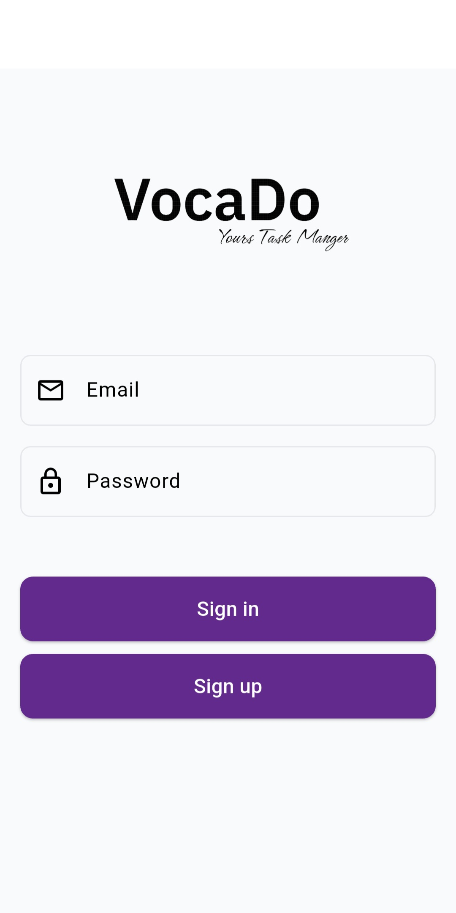
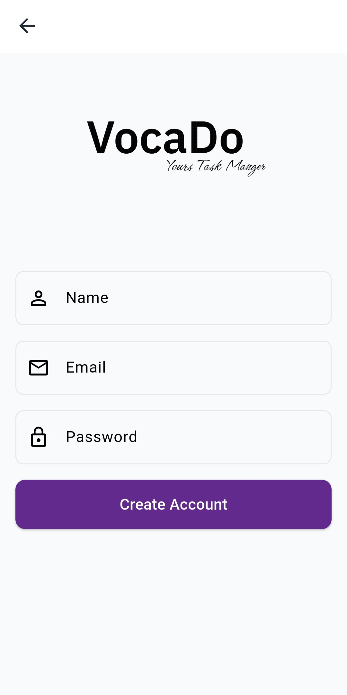
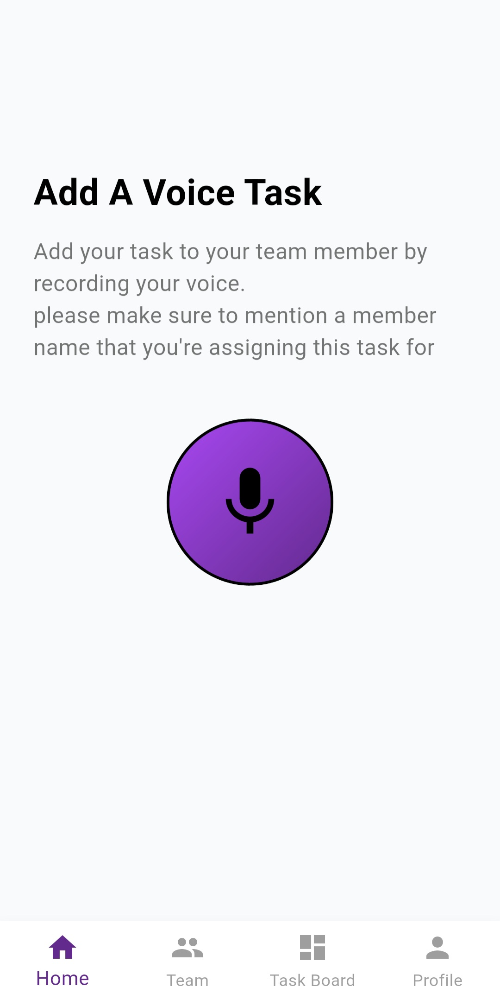
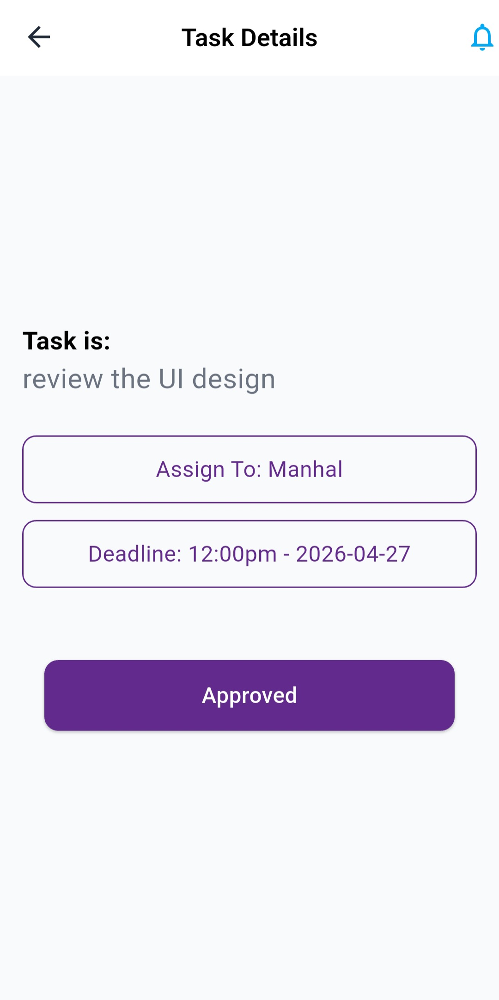
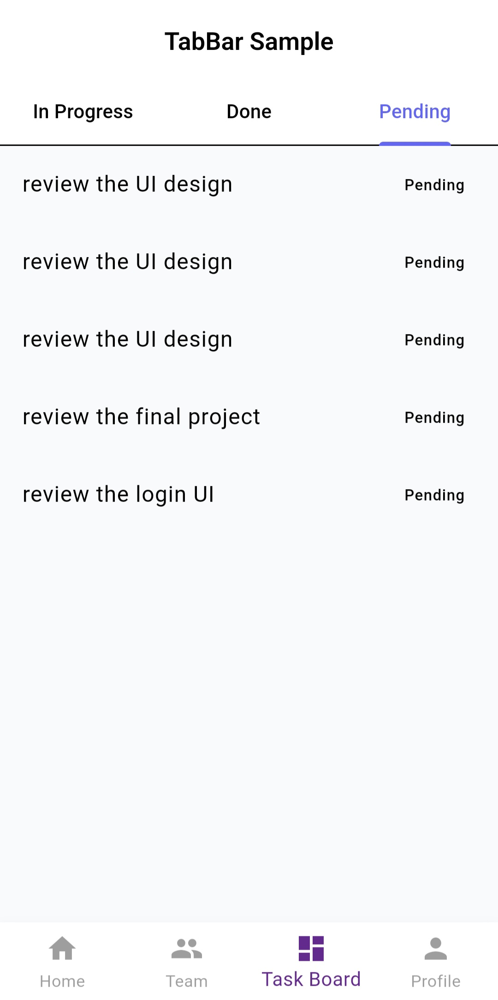
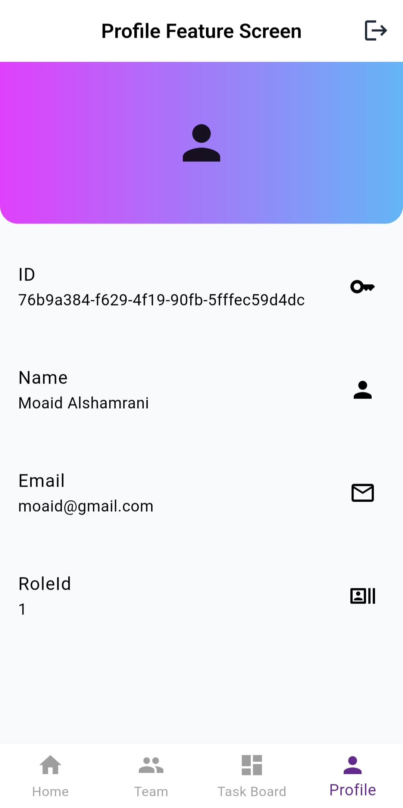
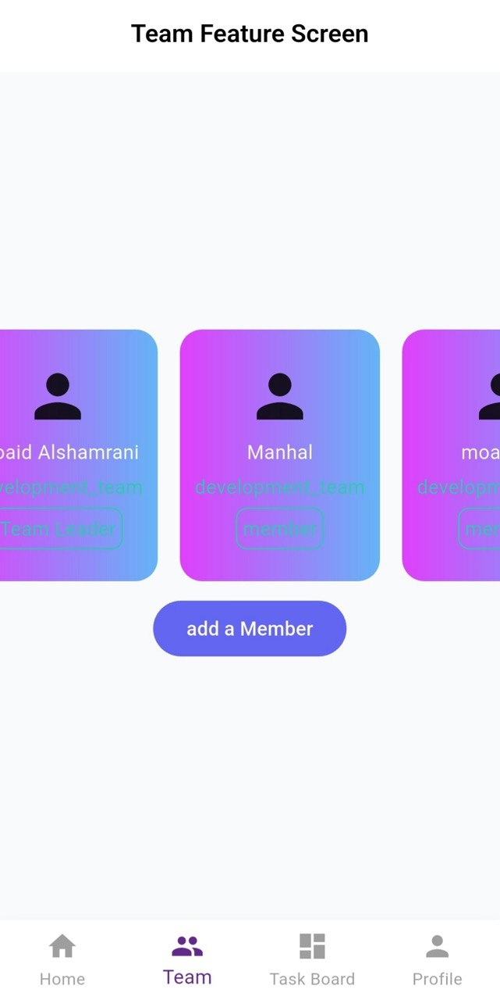
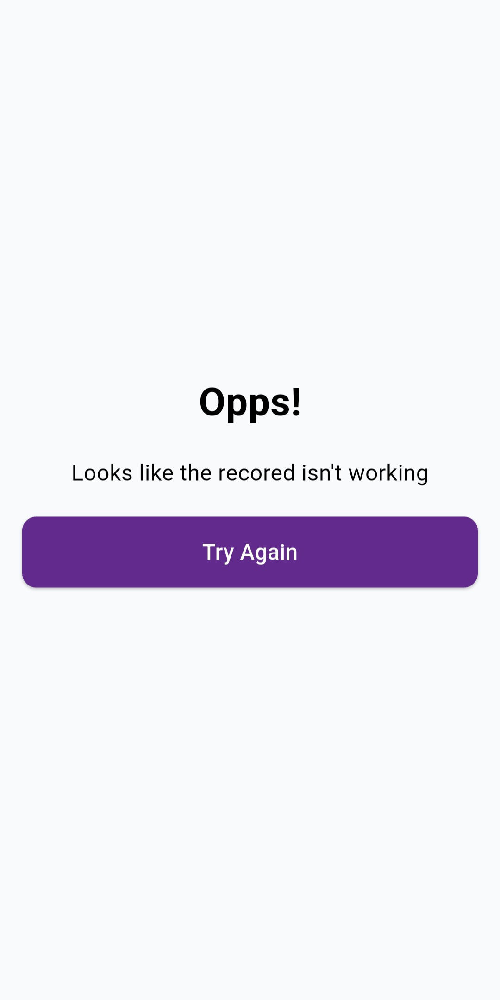
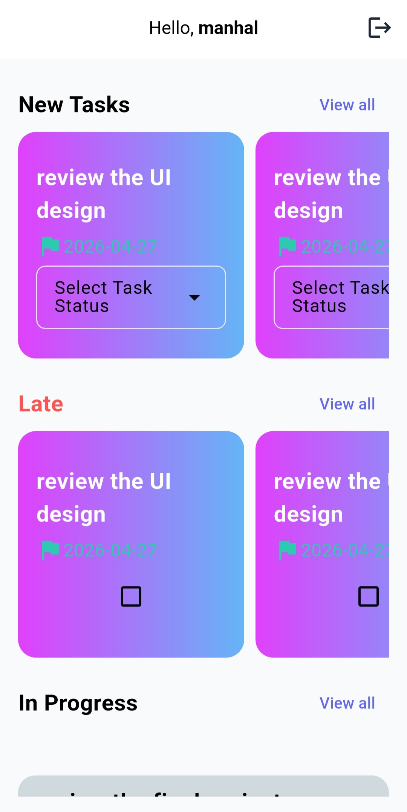

# 🎙 VocaDo: Your Task Manager

VocaDo is a Flutter application that transforms voice input into structured tasks using AI.  
The app allows users to record voice, convert it into JSON tasks using Gemini AI, and manage tasks based on roles (Admin / User).

---

## 📖 Project Overview

Project Name: VocaDo

This app provides:

- 🔐 User Authentication (Admin / User roles)
- 🎙 Voice Task Recording
- 🤖 AI Task Generation using Gemini + Gladia (Speech-to-Text)
- 🧾 Task Confirmation Screen before saving
- 📊 Task Board with filtering (New / In Progress / Late)
- 👥 Team Management (Admin)
- 👤 Profile Management
- ⚠️ Error Handling Screen (Oops state)

The app ensures that voice input is automatically converted into structured tasks that can be assigned and tracked.

---

## 📱 App Flow

1. User logs in (Admin or User)
2. Admin records a voice task 🎙
3. Audio is sent to Speech-to-Text API (Gladia)
4. Text is processed by Gemini AI 🤖
5. Structured JSON task is returned
6. Admin reviews task in Task Details screen
7. Task is approved and saved to database
8. Users view assigned tasks in Task Board

---

## 🧠 Features

- 🔐 Authentication (Supabase Auth)
- 🎙 Voice Recording System
- 🤖 AI Task Generation (STT + Gemini)
- 🧾 Task Approval Screen
- 📊 Task Board (Filters: New / Late / In Progress)
- 👥 Team Management (Admin only)
- 👤 Profile Screen
- ⚠️ Error Screen (Oops state)
- 🔄 Role-based routing (Admin / User)
- ⚡ State Management using Cubit (BLoC)

---

## 🎨 Main Screens

- 🔐 Login Screen
- 🔐 Sign Up Screen
- 🎙 Voice Recorder (Task Creator)
- 🧾 Task Details (Approval Screen)
- 📊 Task Board
- 👥 Team Screen
- 👤 Profile Screen
- ⚠️ Error Screen
- 👤 Task Viewer (User Side)

---

## 📸 Screenshots

| Login | Sign Up | Voice Recorder |
|---|---|---|
|  |  |  |

| Task Details | Task Board | Profile |
|---|---|---|
|  |  |  |

| Team | Error Screen | Task Viewer |
|---|---|---|
|  |  |  |

---

## 🎬 Demo Video

https://drive.google.com/drive/folders/1bF8v9Zcbvk0ySZt0UrN0QCEsCmsGJmbK?usp=sharing

---

## 📦 Packages Used

- flutter_bloc
- supabase_flutter
- get_it
- injectable
- equatable
- json_annotation
- freezed
- dio
- go_router
- any_image_view
- uuid
- lottie
- flutter_launcher_icons

---

## ⚙️ Setup & Installation

1. Clone the repository: `https://github.com/flutter-gg-2026/vocado-m_group.git`
2. Install dependencies: `flutter pub get`
3. Run the app: `flutter run`
